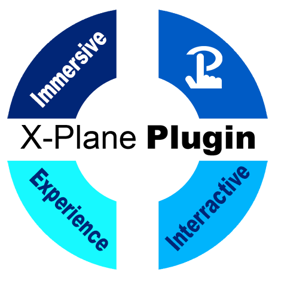
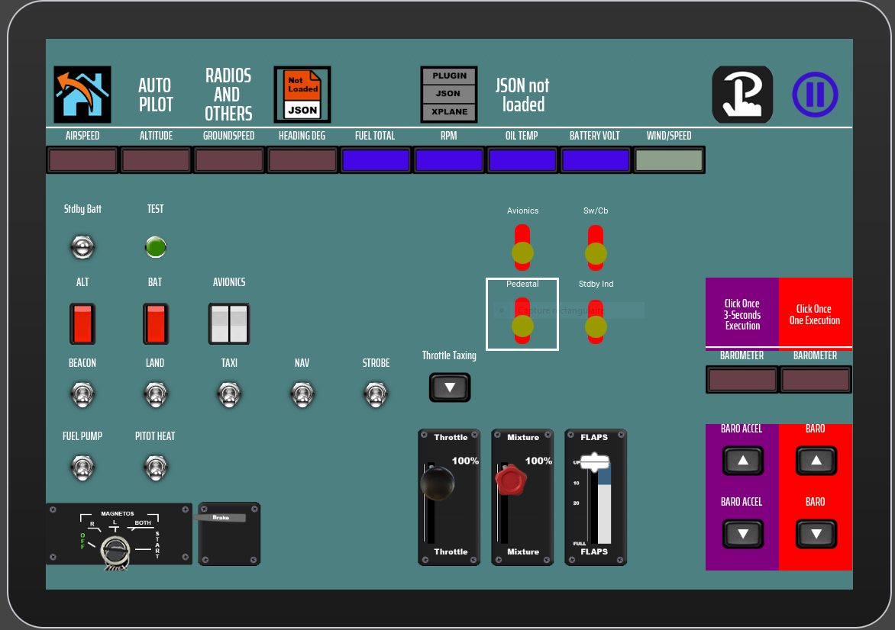
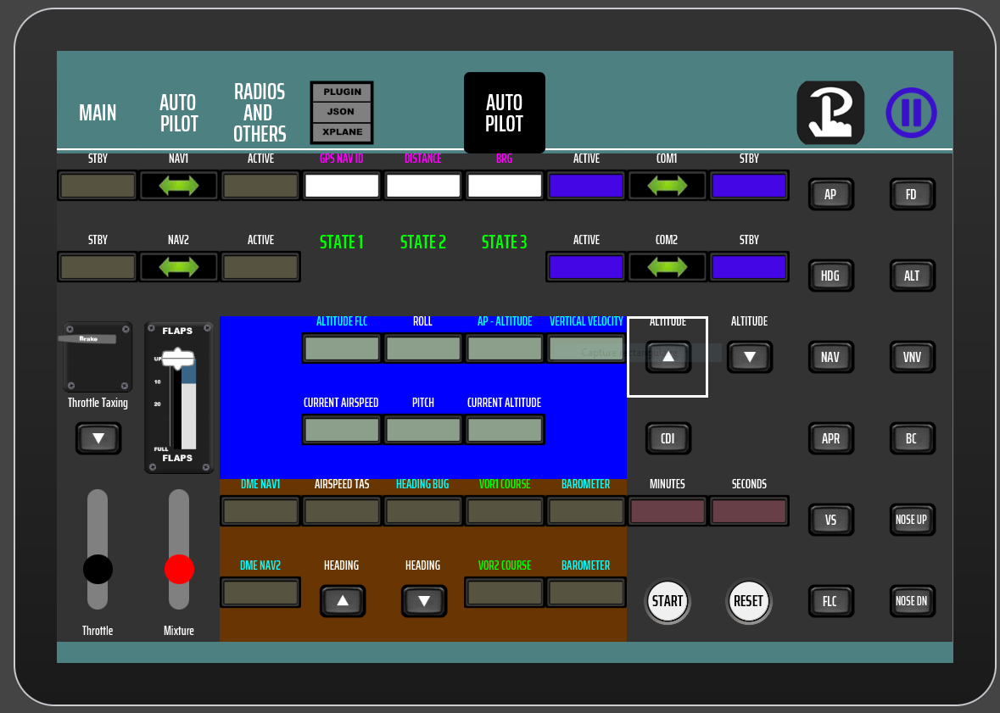
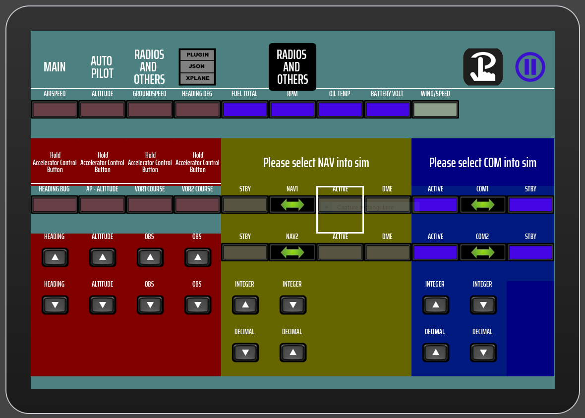

# Plugin X-Plane pour Touch Portal

**For the English version, refer to the README.md file.**

## APERCU

Ce plugin offre des outils pour concevoir des interfaces interactives bidirectionnelles entre Touch Portal et le simulateur X-Plane 12 (non testé avec X-Plane 11). Le plugin propose différents ensembles d'icônes pour vos créations de pages, ainsi que des pages de démo qui permettent de saisir la mécanique utilisée pour communiquer entre Touch Portal et X-Plane. En outre, une page HTML vous offrira la possibilité de générer un fichier JSON qui constitue un élément essentiel de ce plugin. Avec ce plugin, un fichier default.json est inclus. Il s'agit d'un fichier JSON qui renferme en quelque sorte les directives, les datarefs ou les commandes utilisées dans vos pages. Il est possible de concevoir vos propres fichiers JSON pour vos pages personnelles et vos contenus.

## CARACTÉRISTIQUES

Offre la possibilité d'obtenir régulièrement les valeurs des datarefs, comme les lectures d'instruments de vol, les positions de contrôle de vol ou les états de interrupteur. Grâce aux actions contenues dans le plugin et Touch Portal, il est possible de déclencher n'importe quel événement interactif de l'avion, comme la configuration des commutateurs, l'ajustement des contrôles de vol, les fréquences radio, etc. Il offre la possibilité d'exécuter des commandes X-Plane de différentes manières (expliquées dans la Bible de l'utilisateur). Grâce à un fichier JSON, il est possible de configurer complètement le plugin pour faciliter son traitement et sa communication bidirectionnelle avec X-Plane. Afin d'accomplir cela, le plugin emploie une partie client qui communique avec Touch Portal et une partie serveur qui gère les communications ou les envois. Les datarefs contenues dans le fichier JSON seront lues régulièrement du côté du serveur et, lorsque les valeurs changent, elles seront transmises au client afin d'influencer l'affichage des pages de Touch Portal. Il est crucial d'utiliser l'outil DataRefTool pour créer un fichier JSON.

## SYSTÈME D'EXPLOITATION

* Windows 10+

## DOCUMENTATION

[La Bible d'utilisateur](./books/Bible_Utilisateur.pdf)

## GÉNÉRATEUR DE FICHIER JSON

[Page HTML permettant de créer un fichier JSON contenant vos commandes et datarefs](https://coussini.github.io/XPlaneTouchPortalPlugin/)

## INSTALLATION

### Prérequis concernant les fichiers d'installation (les détails suivront après les prérequis) :

#### 1. Vous devez avoir le logiciel **X-Plane 12** installé. Suivez les étapes d'installation grâce à ce lien : [https://www.x-plane.com/](https://www.x-plane.com/).

#### 2. Téléchargez la dernière version de **Python** (gros bouton jaune) : [https://www.python.org/downloads/](https://www.python.org/downloads/).

#### 3. Téléchargez le fichier Zip concernant **XPPython3** : [https://xppython3.readthedocs.io/en/latest/usage/installation_plugin.html](https://xppython3.readthedocs.io/en/latest/usage/installation_plugin.html).

#### 4. Téléchargez l'application **Touch Portal pour Windows** : [https://www.touch-portal.com/](https://www.touch-portal.com/).

#### 5. Téléchargez la dernière version du **fichier Zip du plugin X-Plane pour Touch Portal** : [https://github.com/coussini/XPlaneTouchPortalPlugin/releases](https://github.com/coussini/XPlaneTouchPortalPlugin/releases).

---

### 1. Faites les mises à jour de X-Plane 12 et suivez les prochaines étapes.

---

### 2. Installation de la dernière version de Python :

* Cliquez sur le programme d'installation de Python.
* Cochez **Add Python.exe to PATH** sur la première page de cet installeur. Ne cochez pas **Use admin privileges when installing py.exe**.
* Cliquez un peu plus haut sur **Install Now**.

---

### 3. Installez le fichier Zip (que vous avez téléchargé à l'étape 3) concernant XPPython3, en utilisant les étapes de ce [lien](https://xppython3.readthedocs.io/en/latest/usage/installation_plugin.html).

---

### 4. Installation de Touch Portal :

#### 4.1). Installez l'API pour Touch Portal :

* Ouvrez une invite de commande Windows (en tant qu'administrateur).

* Tapez et exécutez la commande suivante :
  
  > **pip install update**

* Tapez et exécutez la commande suivante :
  
  > **pip install TouchPortal-API**

#### 4.2). Installez l'application Touch Portal sur votre ordinateur Windows :

* Double-cliquez sur l'installateur et installez avec les valeurs de défaut.
* L'installeur demandera un redémarrage de votre ordinateur.
* Après ce redémarrage, ouvrez l'application Touch Portal sur Windows.
* Choisissez **Create (main)**.
* Une petite icône en forme d'enveloppe clignotera en haut et à droite de votre écran d'accueil de Touch Portal.
* Cliquez sur cette icône et suivez les étapes inscrites.
* Notez qu'en bas et à gauche de l'écran d'accueil, vous verrez un petit encadré avec une adresse IP. Nous l'utiliserons à l'étape suivante.
* Laissez l'application Touch Portal ouverte.

#### 4.3). Installez l'application Touch Portal sur votre périphérique utilisant un Wi-Fi :

* Allez dans le lien suivant : [https://www.touch-portal.com/](https://www.touch-portal.com/).
* Allez tout en bas de la page, et vous trouverez un lien concernant les appareils Android ou IOS. Cliquez sur le bouton **PlayStore** ou **AppStore** selon le cas.
* Suivez les étapes concernant ces appareils.
* Ouvrez l'application Touch Portal sur votre périphérique, et lorsque l'on vous demandera une adresse IP, inscrivez l'adresse IP sous le format **000.000.0.000** qui provient du petit encadré (sans le numéro entre parathèse qui représente un **PORT**).
* Vous devriez avoir deux fenêtres identiques sur Windows et sur votre périphérique.
* Vous devez maintenant acheter la version **Pro Upgrade**.
* Les autres options sont libres à vous et ne sont pas requises pour utiliser le plugin X-Plane.
* Pour ce faire, cliquez sur **Settings** (en haut à droite), choisissez **Get Your Upgrades**. Cliquez sur **Buy $$** et suivez les étapes.
* L'option concernant les **multiples Devices Upgrade** n'a pas été testée sur ce plugin.
* **Très important** : dans Settings, l'option **Restore in-app purchases** est fort utile lorsque le comportement de Touch Portal n'est pas conforme à la version **Pro Upgrade**.

---

### 5. Installation du Plugin X-Plane pour Touch Portal :

* Dézippez le fichier Zip sur votre bureau (celui que vous avez téléchargé à l'étape 5).

#### 5.1). Installation des icônes pour le plugin :

* En haut à droite de votre application Touch Portal Windows, cliquez sur l'icône avec **une roue dentée** ou **un engrenage**. Ce sont les Settings.
* Cliquez **Import Icon Pack…**
* Installez tous les fichiers de votre dossier dézipé qui se terminent pour l'extension **.TPI** (*Soyez vigilant pour ne pas installer deux fois le même fichier, car c'est important !*).

#### 5.2). Installation du plugin dans Touch Portal :

* En haut à droite de votre application Touch Portal Windows, cliquez sur l'icône avec **une roue dentée** ou **un engrenage**. Ce sont les Settings.
* Cliquez **Import plug-in…**
* Installez le fichier de votre dossier dézipé qui se termine par l'extension **.TP** (*Soyez vigilant pour ne pas installer deux fois le même fichier, car c'est important !*). 
* **Notez:** Il se peut que votre antivirus analyse le fichier exe contenu dans le fichier **.TP**. Ce fichier ne contient aucun virus.

#### 5.3). Installation des pages démo du plugin dans Touch Portal :

* Sur la page d'accueil, vous verrez en haut plusieurs onglets. Sélectionnez **Pages**. En peu à droite de la liste déroulante, où est inscrit **(main)**, cliquez sur l'icône avec **une roue dentée** ou **un engrenage**. Ce sont les Settings des pages.
* Cliquez **Import Page…**
* Installez tous les fichiers de votre dossier dézipé qui se terminent par l'extension **.TPZ** (*Soyez vigilant pour ne pas installer deux fois le même fichier, car c'est important !*).
* Dans la même liste déroulante, vous devriez avoir :
  * **(main)**
  * **Cessna 172 G1000_1**
  * **Cessna 172 G1000_2**  
  * **Cessna 172 G1000_3** 
* Choisissez **(main)**, si ce n'est pas encore fait.
* Cliquez sur le bouton **Page Settings** et choisissez **10 x 7** comme **Grid Settings**, zéro pour le **Grid margin** et zéro pour les **Button Spacing**.
* Toujours sur votre page **(main)**, double-cliquez à droite de la case jaune ayant comme titre **Press to get help**.
* À droite et en haut de la page qui vient d'apparaître, cliquez sur l'icône qui est tout juste à droite de l'icône en forme de **T**.
* Choisissez **From Iconpacks…**
* Dans la liste déroulante (petite flèche) de cette boite de dialogue, sélectionnez **XP TP BASE ICONS PACK** si ce n'est pas celui qui est affiché.
* Choisissez l'icône qui a un avion dessus.
* Cliquez sur **Icon full button Size** pour obtenir l'image de l'icône agrandie.
* Dans la barre de gauche, sous **GENERAL** et sous **Navigation**, faites un drag and drop de **(Action) Go To Page** sur le milieu de la page en cours.
* Dans la liste déroulante de ce que vous venez de copier, choisissez la page **Cessna 172 G1000_1**.
* Cliquez sur le bouton **Save and Close** en bas de cette page.
* Vous devriez voir apparaître cette nouvelle icône sur votre périphérique.
* Cliquez dessus.
* Ce que vous voyez ici est la première page servant de guide d'utilisateur.

#### 5.4). Installation du serveur dédié au Plugin X-Plane pour Touch Portal dans le dossier de X-Plane 12 :

* Copiez le fichier qui a pour extension **.PY** venant de votre dossier dézippé.
* Coller ce fichier dans **C:\X-Plane 12\Resources\plugins\PythonPlugins** si votre X-Plane 12 est installé sur le disque C :

#### 5.5). Installation du fichier de configuration JSON :

* Maintenant, ouvrez l'explorateur Windows et remplacez le chemin du dossier courant par le texte **%appdata%**.
* Vous devriez être dans le dossier Roaming de votre ordinateur Windows.
* Défilez la liste des dossiers contenus dans Roaming pour trouver **TouchPortal**.
* Double-cliquez sur ce dossier.
* Dans le dossier **misc**, créez un dossier avec le nom **xplane (en minuscule)**.
* Vous devriez avoir sous **misc** le dossier **lightroom** et **xplane**.
* Copier le fichier se terminant par **.JSON** venant de votre dossier dézippé et coller le dans le répertoire que vous venez tout juste de créer.
* Dans le dossier **xplane**, vous devriez voir **default.json**.

#### 5.6). Redémarrage des programmes Touch Portal :

* Dans la barre des tâches dans Windows (*en bas à droite pour Windows 10*), se trouvent des applications qui sont en cours d'exécution, telles que votre antivirus.
* À cet endroit, vous verrez l'**icône de Touch Portal**.
* Faites un clic droit et faites **exit**.
* Redémarrer Touch Portal sur votre Windows.
* Redémarrer Touch Portal sur votre périphérique.
* Cliquez sur l'icône en forme d'avion Cessna.

---

### Félicitation, vous avez installé tout ce qu'il faut pour utiliser le Plugin X-Plane pour Touch Portal.

* Vous êtes maintenant invité à télécharger et **lire attentivement** [la Bible d'utilisateur](./books/Bible_Utilisateur.pdf) du plugin X-Plane, car l'installation est terminée.

## Custom JSON generator

* Vous pouvez utiliser la page [HTML Custom Dataref Json Generator](https://coussini.github.io/XPlaneTouchPortalPlugin/) pour générer vos fichiers JSON correctement

## NOTE IMPORTANTE SUR LES MISES À JOUR DE TOUCH PORTAL

* Si vous installez une nouvelle version de Touch Portal sur votre ordinateur, désinstallez et installez la version que vous utilisez sur vos périphériques (Ipad, Smartphone, etc)

## NOTE IMPORTANTE SUR VOS FICHIERS JSON

* Vos fichiers JSON ne doivent pas inclure ces datarefs, car ils sont déjà inclus à l'interne du plugin
  pour sa gestion
  
  * sim/cockpit2/gauges/actuators/barometer_setting_in_hg_pilot -> Barometer setting (pilot)
  
  * sim/cockpit2/gauges/actuators/barometer_setting_in_hg_copilot -> Barometer setting (co-pilot)
  
  * sim/cockpit2/gauges/actuators/barometer_setting_in_hg_stby -> Barometer setting (standard)
  
  * sim/aircraft/view/acf_descrip -> Aircraft Name Description (full name)

## PAGES DE DÉMO
### Page 1

### Page 2

### Page 3

