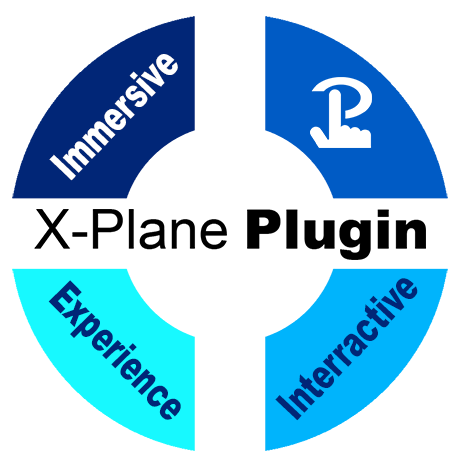

# X-Plane Plugin for Touch Portal

**Pour la version française, reférez-vous au fichier LISEZMOI.MD.**

## OVERVIEW

This plugin provides tools for designing bidirectional interactive interfaces between Touch Portal and the X-Plane 12 simulator (not tested with X-Plane 11). The plugin offers different sets of icons for your creations, as well as demo pages to understand the logic used to communicate between Touch Portal and X-Plane. In addition, an HTML page will give you the ability to generate a JSON file wich is an essential part of this plugin. With this plugin, a default.json file is included. This is a JSON file that somehow contains the guidelines, datares or commands used in your pages. It is possible to create your own JSON files for your personals aircrafts.

## FEATURES

Gives the option to frequently acquire dataref values, including switch statuses, aircraft control positions, and readings from flying instruments. Any interactive event on the aircraft, such as configuring switches, adjusting flying controls, radio frequencies, etc., can be triggered by using the actions found in the plugin and Touch Portal. It provides way to run X-Plane commands in several methods, as detailed in the user's Guide. The plugin can be fully configured to enable processing and two-way communication with X-Plane, all thanks to a JSON file. The plugin uses a server component that handles submissions and communications and a client component that interacts with Touch Portal to do this. The JSON file's datarefs will be routinely read by the server and, if their values change, will be sent to the client to affect the Touch Portal pages are shown. Making a JSON file with the DataRefTool utility is essential.

## OPERATING SYSTEM

* Windows 10+ 

## DOCUMENTATION

[User Guide](./books/User_Guide.pdf)

## JSON FILE GENERATOR

[HTML Json Generator for your custom dataref and command](https://coussini.github.io/XPlaneTouchPortalPlugin/)

## INSTALLATION

### Prerequisites for installation files (details to follow after prerequisites):

#### 1. You must have the **X-Plane 12** software installed. Follow the installation steps at this link: [https://www.x-plane.com/](https://www.x-plane.com/).
#### 2. Download the latest version of **Python** (big yellow button): [https://www.python.org/downloads/](https://www.python.org/downloads/).
#### 3. Download the Zip file for **XPPython3**: [https://xppython3.readthedocs.io/en/latest/usage/installation_plugin.html](https://xppython3.readthedocs.io/en/latest/usage/installation_plugin.html).
#### 4. Download the **Touch Portal for Windows** application: [https://www.touch-portal.com/](https://www.touch-portal.com/).
#### 5. Download the latest version of the **X-Plane plugin for Touch Portal Zip file**: [https://github.com/coussini/XPlaneTouchPortalPlugin/releases](https://github.com/coussini/XPlaneTouchPortalPlugin/releases).
---

### 1. Update X-Plane 12 and follow the next steps.
---

### 2. Install the latest version of Python:

* Click on the Python installer.
* Check **Add Python.exe to PATH** on the first page of the installer. Do not check **Use admin privileges when installing py.exe**.
* Click **Install Now**.
---

### 3. Install the Zip file (downloaded in step 3) for XPPython3 using the steps from this [link](https://xppython3.readthedocs.io/en/latest/usage/installation_plugin.html).
---

### 4. Install Touch Portal:

#### 4.1). Install the API for Touch Portal:

* Open a Windows command prompt (as administrator).
* Type and execute the following command:
  
  > **pip install update**
* Type and execute the following command:
  
  > **pip install TouchPortal-API**

#### 4.2). Install the Touch Portal application on your Windows computer:

* Double-click the installer and install with default values.
* The installer will prompt for a restart of your computer.
* After the restart, open the Touch Portal application on Windows.
* Choose **Create (main)**.
* A small envelope icon will flash at the top right of your Touch Portal home screen.
* Click this icon and follow the steps.
* Note that at the bottom left of the home screen, you will see a small box with an IP address. We will use this in the next step.
* Leave the Touch Portal application open.

#### 4.3). Install the Touch Portal application on your Wi-Fi device:

* Go to the following link: [https://www.touch-portal.com/](https://www.touch-portal.com/).
* Go to the bottom of the page, and you will find a link for Android or iOS devices. Click the **PlayStore** or **AppStore** button as applicable.
* Follow the steps for these devices.
* Open the Touch Portal application on your device, and when asked for an IP address, enter the IP address in the format **000.000.0.000** from the small box (without the number in parentheses representing a **PORT**).
* You should have two identical windows on Windows and your device.
* You now need to purchase the **Pro Upgrade** version.
* Other options are optional and not required to use the X-Plane plugin.
* To do this, click **Settings** (top right), choose **Get Your Upgrades**. Click **Buy $$** and follow the steps.
* The **multiple Devices Upgrade** option has not been tested on this plugin.
* **Very important**: in Settings, the **Restore in-app purchases** option is very useful when Touch Portal behavior is not consistent with the **Pro Upgrade** version.
---

### 5. Install the X-Plane Plugin for Touch Portal:

* Unzip the Zip file on your desktop (downloaded in step 5).

#### 5.1). Install the icons for the plugin:

* At the top right of your Touch Portal Windows application, click the icon with **a gear**. These are the Settings.
* Click **Import Icon Pack…**
* Install all files from your unzipped folder that end with the **.TPI** extension (*Be careful not to install the same file twice, as this is important!*).

#### 5.2). Install the plugin in Touch Portal:

* At the top right of your Touch Portal Windows application, click the icon with **a gear**. These are the Settings.
* Click **Import plug-in…**
* Install the file from your unzipped folder that ends with the **.TP** extension (*Be careful not to install the same file twice, as this is important!*).
* **Note:** Your antivirus may scan the exe file contained within the .TP file. This file does not contain any viruses.

#### 5.3). Install the plugin demo pages in Touch Portal:

* On the home page, you will see several tabs at the top. Select **Pages**. To the right of the drop-down list, where **(main)** is written, click the icon with **a gear**. These are the page Settings.
* Click **Import Page…**
* Install all files from your unzipped folder that end with the **.TPZ** extension (*Be careful not to install the same file twice, as this is important!*).
* In the same drop-down list, you should have:
  * **(main)**
  * **Cessna 172 G1000_1**
  * **Cessna 172 G1000_2**
  * **Cessna 172 G1000_3**
* Choose **(main)** if not already selected.
* Click the **Page Settings** button and choose **10 x 7** as **Grid Settings**, zero for **Grid margin**, and zero for **Button Spacing**.
* Still on your **(main)** page, double-click to the right of the yellow box titled **Press to get help**.
* At the top right of the page that appears, click the icon just to the right of the **T** icon.
* Choose **From Iconpacks…**
* In the drop-down list (small arrow) of this dialog box, select **XP TP BASE ICONS PACK** if it is not displayed.
* Choose the icon with an airplane on it.
* Click **Icon full button Size** to get the enlarged icon image.
* In the left bar, under **GENERAL** and under **Navigation**, drag and drop **(Action) Go To Page** to the middle of the current page.
* In the drop-down list of what you just copied, choose the **Cessna 172 G1000_1** page.
* Click the **Save and Close** button at the bottom of this page.
* You should see this new icon appear on your device.
* Click on it.
* What you see here is the first page serving as a user guide.

#### 5.4). Install the dedicated server for the X-Plane Plugin for Touch Portal in the X-Plane 12 folder:

* Copy the file with the **.PY** extension from your unzipped folder.
* Paste this file into **C:\X-Plane 12\Resources\plugins\PythonPlugins** if your X-Plane 12 is installed on the C drive:

#### 5.5). Install the JSON configuration file:

* Now, open Windows Explorer and replace the current folder path with **%appdata%**.
* You should be in the Roaming folder of your Windows computer.
* Scroll through the list of folders in Roaming to find **TouchPortal**.
* Double-click this folder.
* In the **misc** folder, create a folder named **xplane (lowercase)**.
* You should have under **misc** the folders **lightroom** and **xplane**.
* Copy the file ending in **.JSON** from your unzipped folder and paste it into the directory you just created.
* In the **xplane** folder, you should see **default.json**.

#### 5.6). Restart the Touch Portal programs:

* In the Windows taskbar (*bottom right for Windows 10*), there are applications running, such as your antivirus.
* Here, you will see the **Touch Portal icon**.
* Right-click and select **exit**.
* Restart Touch Portal on your Windows.
* Restart Touch Portal on your device.
* Click on the Cessna airplane icon.
---
### Congratulations, you have installed everything needed to use the X-Plane Plugin for Touch Portal.

* You are now invited to download and to **read carefully** the X-Plane plugin [User Guide](./books/User_Guide.pdf), as the installation is complete.

## Custom JSON generator

* You can use the page [HTML Json Generator for your custom dataref and command](https://coussini.github.io/XPlaneTouchPortalPlugin/) to generete your JSON file correctly

## IMPORTANT NOTE ON TOUCH PORTAL UPDATE

* If you installing a new version of Touch Portal on your computer, uninstall and re-install the version you are using on your devices (Ipad, Smartphone, etc)

## IMPORTANT NOTE ON JSON FILES

* Your JSON files must not contain these datarefs, as they are already managed internally by the plugin.

  * sim/cockpit2/gauges/actuators/barometer_setting_in_hg_pilot -> Barometer setting (pilot)
  
  * sim/cockpit2/gauges/actuators/barometer_setting_in_hg_copilot -> Barometer setting (co-pilot)
  
  * sim/cockpit2/gauges/actuators/barometer_setting_in_hg_stby -> Barometer setting (standard)
  
  * sim/aircraft/view/acf_descrip -> Aircraft Name Description (full name)

## DEMO PAGES
### Page 1

### Page 2

### Page 3

